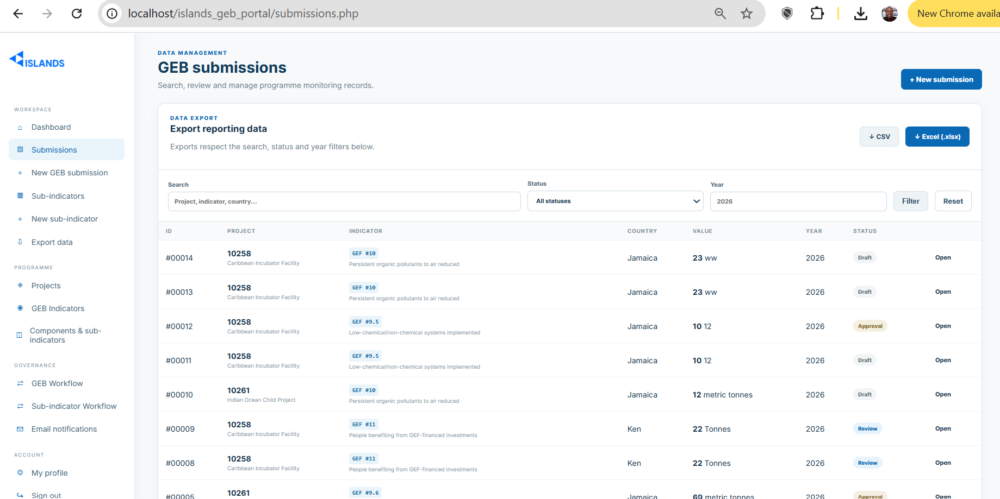
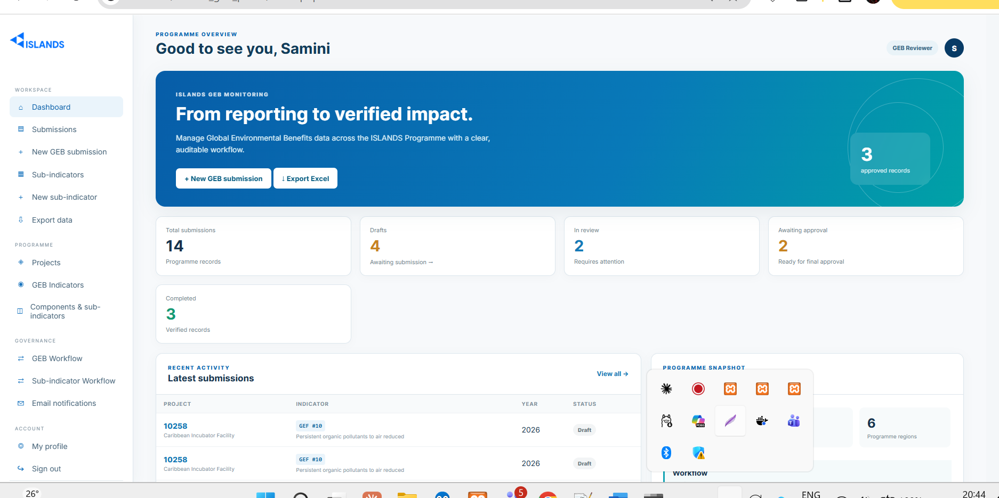

# \# ISLANDS Programme App

# 

# An end-to-end digital system for programme monitoring and reporting, supporting data entry, indicator tracking, validation, analysis and dashboard visualization.

# 

# <table>

# <tr>

# <td width="55%">

# 

# 

# 

# </td>

# <td width="45%">

# 

# <h2>Data Entry Form</h2>

# 

# 

# The ISLANDS Programme Data Entry Form provides a structured interface for capturing programme monitoring and reporting information.

# 

# 

# 

# It supports standardized entry of project, component, indicator, baseline, target and progress information.

# 

# 

# </td>

# </tr>

# 

# <tr>

# <td width="55%">

# 

# 

# 

# </td>

# <td width="45%">

# 

# <h2>Dashboard</h2>

# 

# 

# The ISLANDS Programme Dashboard provides an interactive view of programme performance and monitoring results.

# 

# 

# 

# It enables users to review indicators, targets, progress and other programme-level monitoring information.

# 

# 

# </td>

# </tr>

# </table>

# 

# \## Key Features

# 

# \- Programme and project data management

# \- Indicator and sub-indicator tracking

# \- Baseline and target management

# \- Progress monitoring

# \- Data validation

# \- Dashboard visualization

# \- Monitoring and reporting workflows

# 

# \## Technology

# 

# \- PHP

# \- MySQL/MariaDB

# \- HTML/CSS/JavaScript

# \- Apache/XAMPP

